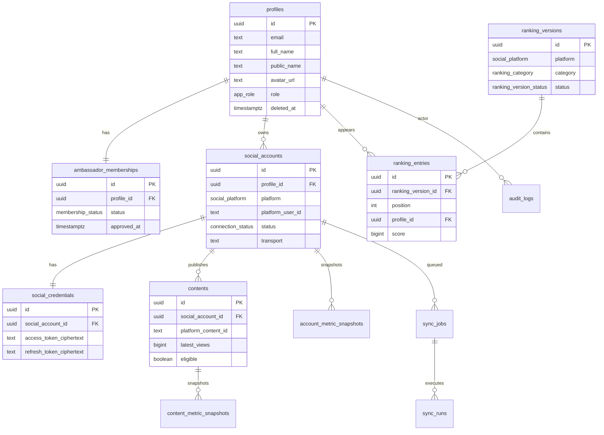

# Diagrama do modelo de dados

## Regras importantes

- `UNIQUE (platform, platform_user_id)` em `social_accounts` impede a mesma conta social em dois embaixadores.
- `UNIQUE (profile_id, platform)` limita a uma conta Instagram e uma TikTok por pessoa no MVP.
- Contadores em `BIGINT`.
- Snapshots acumulados: nunca somar snapshots sucessivos do mesmo contador.
- Credenciais só no servidor; RLS nega acesso via PostgREST a `social_credentials`.
- Papel admin em `profiles.role`, não em `user_metadata`.

## Consentimento e retenção

Ver `docs/SECURITY_PRIVACY.md`.
